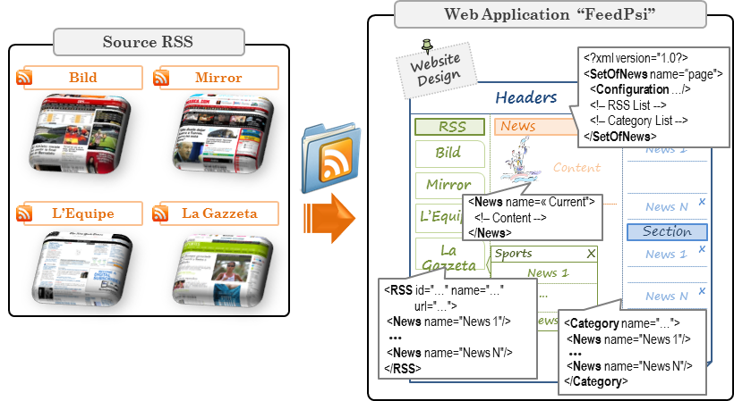
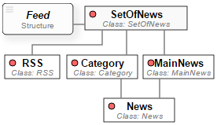
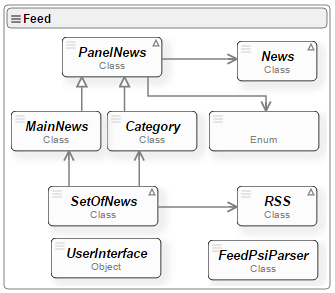

# FeedPsi
**FeedPsi** is web application implemented with the goal of creating and deploying a dynamic web page by aggregating content 
from several web sources in order to build a News Portal. The FeedPsi web application aims to illustrate the use 
of [PsiXML Evaluation Engine](http://hilas.ii.uam.es).

## 1. Goal
The **FeedPsi web application** aims to illustrate the use of *PsiXML Interpreter and PsiXML Evaluation Engine*. Briefly, it is web application 
implemented with the goal of creating and deploying a dynamic web page by aggregating content from several web sources in order to build a 
News Portal. These sources are formatted in RSS, written in XML Language.

Along this section, we will expose the complete cycle from problem analysis to implementation by using the PsiXML Interpreter. Thus, we will detail 
how to build the **FeedPsi Language** and encapsulate it in a Psi Component, and then, we will expose how the Psi Program is evaluated and how the dynamic 
website is generated as a result.

## 2. Analysis and design
In Figure 1 we can see the design of the FeedPsi web application. It manages RSS feeds, allowing us to choose, display, store by category and/or dispose news. 
In addition, the figure shows the **FeedPsi Language**, which is implemented in Feed Component and evaluated on the Interpreter PsiXML shown. **FeedPsi** will 
need to manage the list of RSS feeds (**RSS** multiple tags), the list of categories (multiple **Category** tags) and the list of current news selected by 
the user (one **MainNews** tag). When a RSS feed is read, the headlines are available in a floating submenu (see Figure 1). Once labelled, news can be displayed 
and/or stored in any of its categories for later reading.

The proposed web application does not require server-side programming, being possible to make the entire application deployment on the web client, with minimal 
computational cost on the server.

<br>
**Figure 1**. Design of a web application to aggregate news via RSS feeds, through the creation of a **Psi Language**.

## 2. FeedPsi Grammar
Figure 2 shows shows the [Psi Language Structure Diagram](http://hilas.ii.uam.es/api) of the FeedPsi Language. The **SetOfNews** tag is the element root in the 
*FeedPsi Program* evaluation. It contains the list of RSS sources (**RSS** tag), the list of Categories (**Category** tag) and the currently new shown 
(**MainNews** tag).

<br>
**Figure 2**. Language structure diagram of the **FeedPsi Grammar**.

The **RSS** tag has an identifier, a name and the URL for the RSS source. It has the capability to connect via AJAX to fetch the data from the RSS news service. 
The **Category** tag has list news stored by category. It has an identifier and the category title. The **MainNews** tag contains list of news currently displayed 
to the user. Finally, the **News** tag contains the news obtained from the RSS feed, which has an unique identifier and it is displayed if it is under the **MainNews** tag.

## 3. Classes diagram
Figure 3 shows the class diagram for the **Feed Component**. In the diagram we can see the functionality associated to the set of news (*SetOfNews* class) where 
we can add and remove both RSS feeds and categories. Each RSS source (*RSS* class) has the ability to update their content making an AJAX call by using the associated 
URL, create a news entry, and create a sub-cathegory of headlines with the help of the *SetOfNews* class.

In addition, categories (*Category* class) and current displayed news (*MainNews* class) can be managed (add, delete or verify) by using the *PanelNews* class. 
The *MainNews* class has been implemented to visualize that news chosen from the RSS sources or from the different categories. Meanwhile, the News class defines 
news with a unique id and it is in charge of drawing the news. The *UserInterface* will be in charge of process and draw the interface for the **FeedPsi web application**.

<br>
**Figure 3**. Classes diagram of the **Feed Component**.

## 4. Running the FeedPsi web application
In order to show how the **Feed Component** runs together with the FeedPsi Language to implement the **FeedPsi Web Application**, we will show how it Works with the 
RSS source for the next journals: Bild, Mirror, AS, La Gazzeta, L’Equipe y El Tiempo.

Thus, XML document shows the *FeedPsi source code* that implements the FeedPsi Web Application (the news aggregator). In order to create the web application, the Psi 
Interpreter uses jQuery User Interface, a visual component JavaScript library.

```xml
<?xml version="1.0" encoding="utf-8"?>
<SetOfNews name="RSS Sports Psi Style">
  <RSS id="theguardian" title="England: The Guardian" image="images/rss/mirrorsport.png" 
       url="http://feeds.theguardian.com/theguardian/uk/sport/rss"/>
  <RSS id="as" title="Spain: AS" image="images/rss/as.png" 
       url="http://as.com/rss/tags/ultimas_noticias.xml"/>
  <RSS id="lagazzetta" title="Italy: La Gazzetta" image="images/rss/lagazzetta.png" 
       url="http://www.gazzetta.it/rss/home.xml"/>
  <RSS id="lequipe" title="France: L'Equipe" image="images/rss/lequipe.png" 
       url="http://www.lequipe.fr/rss/actu_rss.xml"/>
  <RSS id="bild" title="Germany: Bild Sport" image="images/rss/bild.png" 
       url="http://rss.bild.de/bild-sport.xml"/>
  <RSS id="eltiempo" title="Colombia: El Tiempo" image="images/rss/eltiempo.png" 
       url="http://www.eltiempo.com/deportes/rss.xml"/>
  
  <MainNews title="Latest Sports News"/>
  
  <Category id="football" title="Football"/>
  <Category id="cycling" title="Cycling"/>
  <Category id="tennis" title="Tennis"/>
  <Category id="motor" title="Motor"/>
</SetOfNews>
```